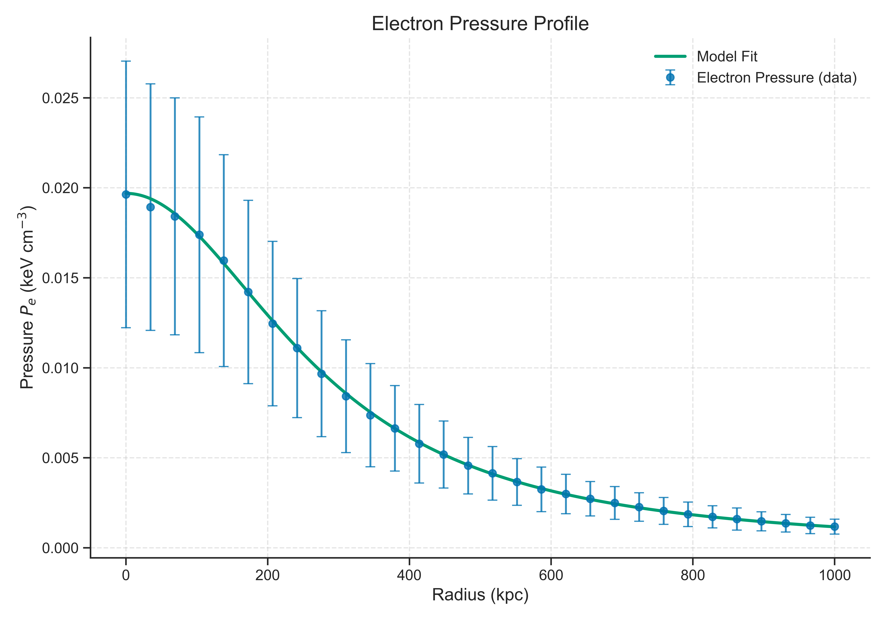
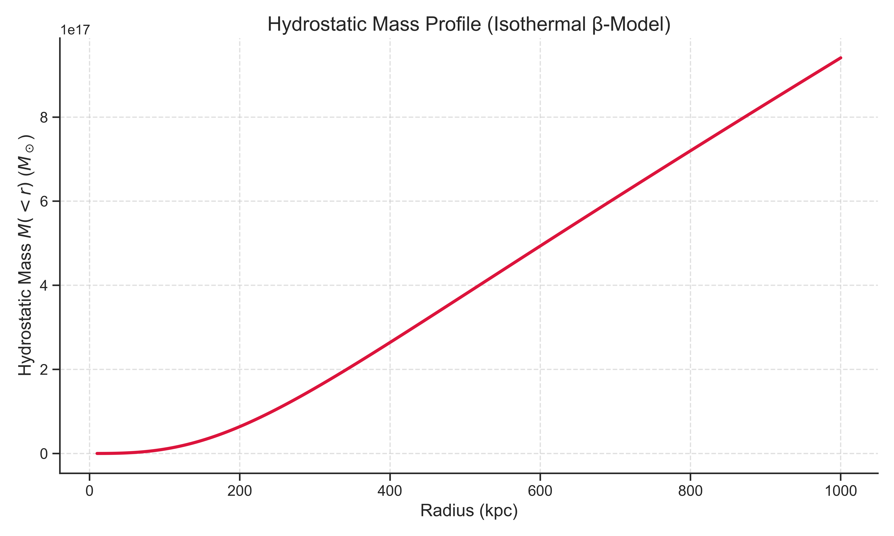

# A2163 X-ray Analysis and Intracluster Medium Modeling

This repository contains the X-ray surface brightness analysis and physical modeling of the massive galaxy cluster **Abell 2163**, using Chandra ACIS-I observations.

The analysis includes:
- Surface brightness fitting using single and double β-models.
- Posterior sampling using MCMC (`emcee`) and uncertainty estimation.
- Derivation of key physical parameters from the X-ray data:
  - Core radius \( R_0 \)
  - Central electron density \( n_{e0} \)
  - Gas mass profile
  - Electron pressure profile
  - Hydrostatic total mass profile

  ## 📁 Repository Structure

  ```
a2163-xray-analysis/
├── scripts/               # Python scripts for fitting and physical parameter extraction
│   ├── rprofile_fit.py
│   ├── rprofile_fit_sherpa.py
│   ├── extract_radial_profile.py
│   └── physical_parameters_calc.py
│
├── results/               # Fit result and computed physical parameters
│   ├── fit_result
│   ├── fit_params.json
│   └── physical_parameters.json
│
├── graphs/                # Final plots for publication/reporting
│   ├── surface_brightness.png
│   ├── electron_pressure_profile.png
│   └── hydrostatic_mass_profile.png
│
├── report/                # Optional LaTeX scientific report
│   └── a2163_report.tex
│
├── requirements.txt       # Python package dependencies (optional)
├── LICENSE                # License (e.g., MIT or Apache-2.0)
└── README.md              # You're here
```

## 🔬 Data & Restrictions

⚠️ **Note:** Due to copyright restrictions, this repository **does not** include any Chandra data files (e.g., `.fits`, `.evt`, `.pi`, `.arf`, `.rmf`). Only derived results and scripts are shared.

## 📊 Key Methods

- **Beta Model Fitting**: Sherpa and SciPy used for parameter estimation.
- **Posterior Sampling**: `emcee` for β-model uncertainty quantification.
- **Gas Mass & Electron Density**: Derived using the analytical integral of the β-model.
- **Pressure & Hydrostatic Mass**: Computed with physical assumptions and visualized with Seaborn.

## 📚 References

- [Chandra CIAO Tools](https://cxc.harvard.edu/ciao/)
- [Sherpa Fitting Documentation](https://sherpa.readthedocs.io/)
- Relevant astrophysics literature on A2163 surface brightness and pressure modeling.

---

Feel free to use this for modeling other clusters by modifying the input radial profile and updating redshift & cosmology parameters accordingly.

## 📈 Summary of Results

| Parameter                  | Value                        | Uncertainty         |
|---------------------------|------------------------------|---------------------|
| Core radius \( R_0 \)     | 296.97 kpc                   | ± 72.42 kpc         |
| Central electron density \( n_{e0} \) | 1.58 × 10⁻³ cm⁻³         | ± 5.78 × 10⁻⁴ cm⁻³  |
| Temperature \( kT \)      | 12.47 keV                    | ± 1.97 keV          |
| Abundance                 | 0.356                        | ± 0.126             |
| Spectral Norm             | 1.72 × 10⁻³                  | ± 5.88 × 10⁻⁵       |
| Gas Mass (r &lt; 1 Mpc)    | 2.50 × 10¹³ \( M_\odot \)     | from MCMC sampling  |

## 🖼️ Key Result Plots

### Surface Brightness Fit


### Electron Pressure Profile


### Hydrostatic Mass Profile


## 🔐 License Information

This repository is licensed under the **GNU General Public License v3.0 (GPL-3.0)** to comply with the licensing terms of key scientific packages it depends on.

### Project License

This project is licensed under the **GNU General Public License v3.0** (GPL-3.0).  
See the [LICENSE](./LICENSE) file for details.

- The core analysis is built around [Sherpa](https://github.com/sherpa/sherpa), which is licensed under **GPL-3.0**.
- As a result, this repository and all associated scripts are distributed under the same license.
